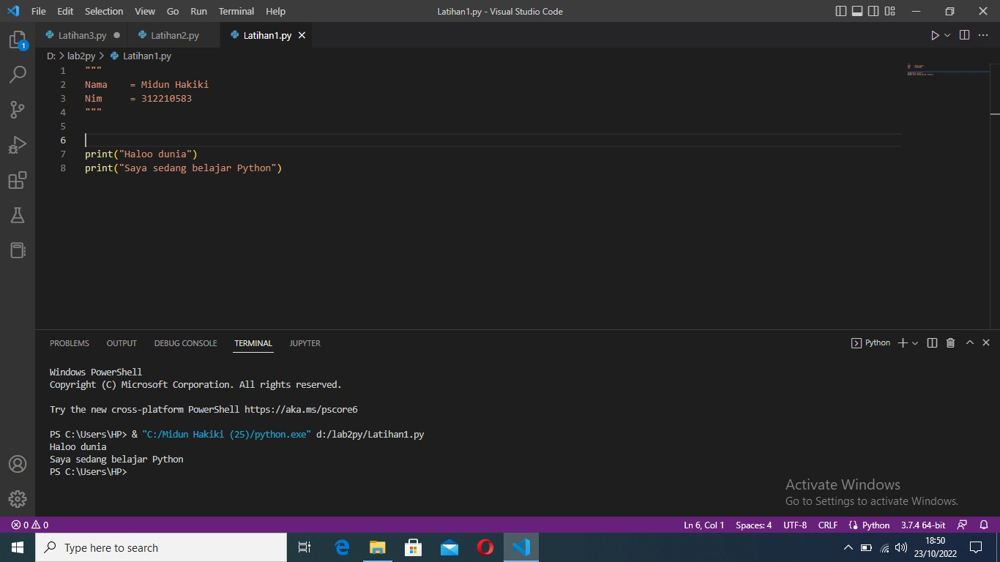
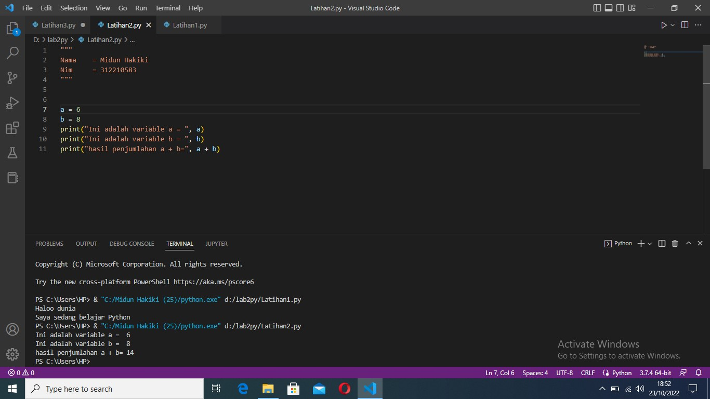

# belajar python

"""
Nama    = Midun Hakiki
Nim     = 312210583
Kelas   = 22.IT.B1
"""

[latihan 1](#latihan-1)
[latihan 2](#latihan-2)
[latihan 3](#latihan-3)

## latihan 1
membuat latihan 1
ikuti kode dibawah ini :

```python
# print()method untuk menampilkan output
# kita akan menampilkan beberapa output berupa string
print ("hallo")
print("saya sedang belajar python")

```

Berikut hasil dari kode diatas
 

## latihan 2
membuat latihan 2
ikutin kode di bawah ini :

```python
#membuat variabel a & b menyimpan nilai
a = 6
b = 8

# menjumlahkan variabel a & b dan disimpan didalam variabel c
c = a + b

# menampilkan output variabel a & c
print("ini adalah variabel a = ", a)
print("ini adalah variabel b = ", b)
# menampilkan output variabel c hasil dari penjumlahan a + b
print("hasil penjumlahan a + b = ", c)

```

berikut hasil dari code diatas
 

## latihan 3
membuat latihan 3
ikuti code dibawah ini :

```python
# masukan atau input nilai variabel a dan b
a = input("masukan nilai a: ")
b = input("masukan nilai b: ")

# menampilkan isi variabel a dan b yang sudah di input sebelumnya
print("variabel a =",a)
print("variabel b =",b)

print("pengabungan {0} & {1} = ".format(a, b) + (a + b))

# mengkonversi nilai variabel ke integer dengan methon int()
a = int(a)
b = int(b)

# menampilkan hasil penjumlahan dari a + b
print("hasil penjumlahan {0} & {1} = %d".format(a, b ) % (a+b))

# menampilkan hasil pembagian dari a / b
print("hasil pembagian {0} / {1} = %d".format(a, b ) % (a/b))

# menampilkan hasil perkalian dari a * b
print("hasil penjumlahan {0} & {1} = %d".format(a, b ) % (a*b))
 
```


berikut hasil dari code diatas
 
 